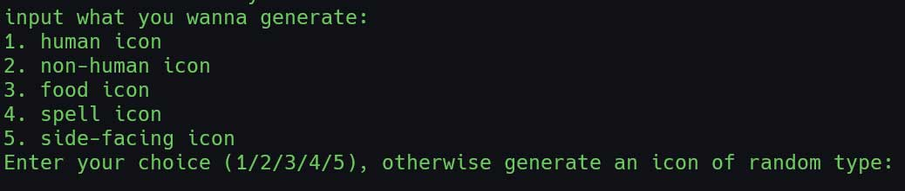

## diffusion.c

This is a standalone inference engine of diffusion models written in C. You can train the tiny diffusion model in pytorch, then run the model with diffusion.c.


This is an experimental project, trying to rewrite diffusion model purely by basic operations in C without any "black boxes". The meat of this project was writing the C inference engine in [diffusion.c](diffusion.c).

### train with python

you can train the tiny diffusion model in minutes, just run 

```
pip install -r requirement.txt
python train.py
```

After training, you will get a binary model file `ckpt.bin` in the `weights` folder.


### inference with c

compile diffusion.c with:

```
gcc -O3 -o diffusion diffusion.c -lm
```

deploy the inference code, simply run
```
./diffusion
```



### Acknowledgement

The training code is adapted from [minDiffusion](https://github.com/cloneofsimo/minDiffusion)
and [the deeplearning course](https://www.deeplearning.ai/short-courses/how-diffusion-models-work)